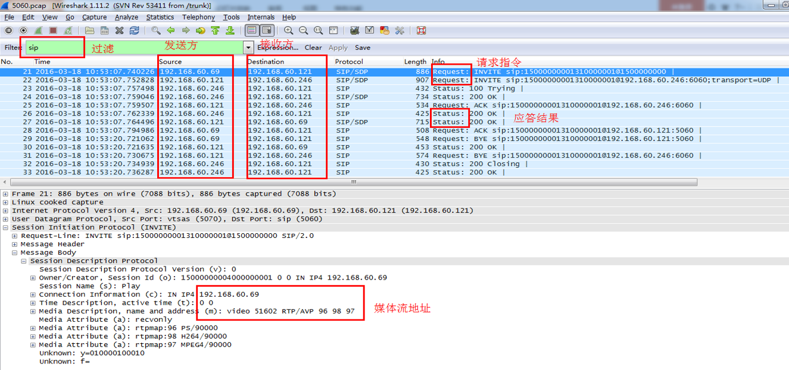
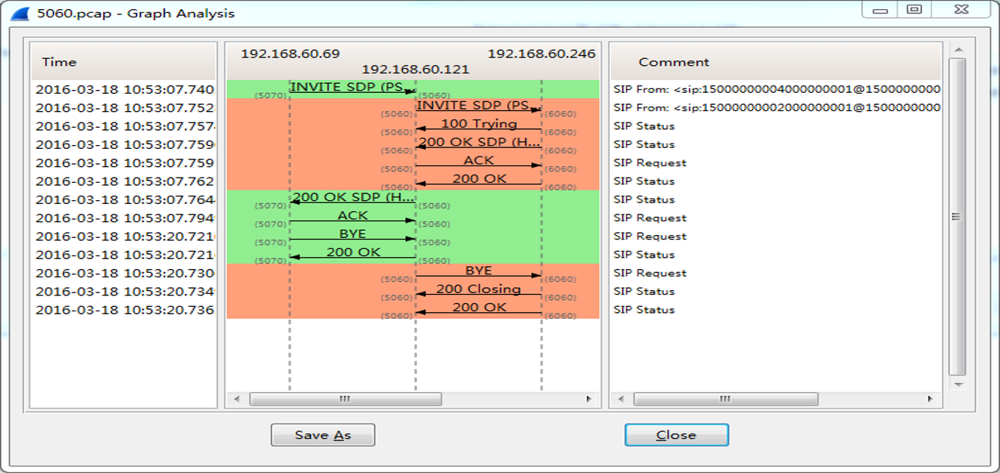
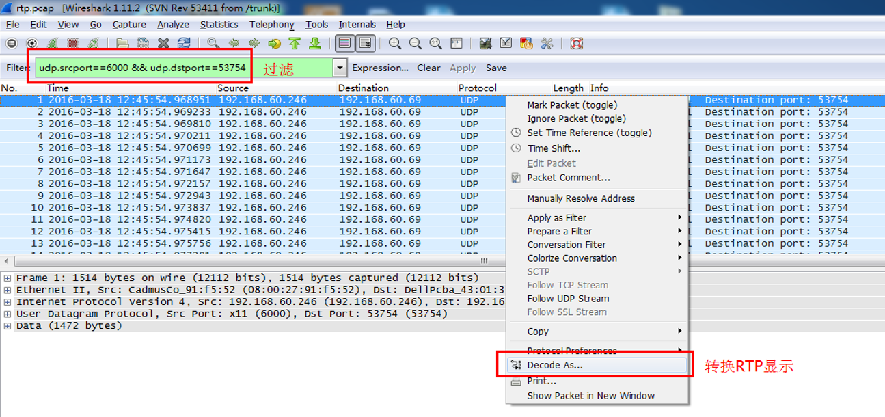
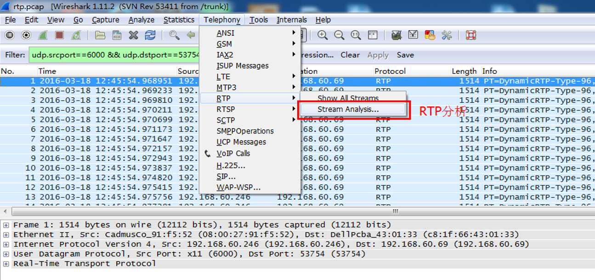
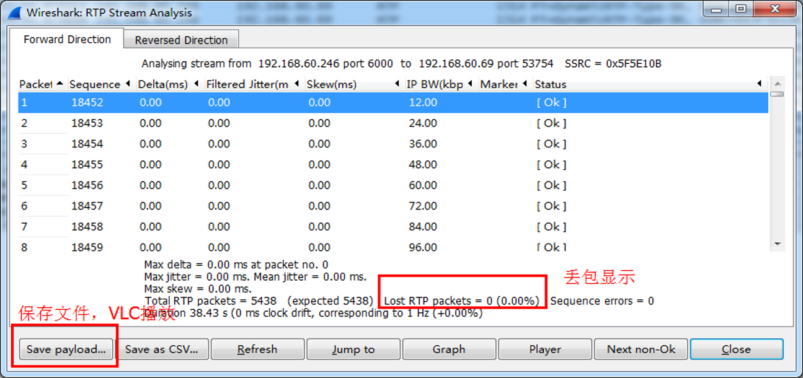

# 国标网关FAQ

---

## 一，配置

### 1，国标网关注意哪些配置？
* 做上级时候不需要配置媒体服务，除非需要流中转
* 配置sipclient用户时候，不开启心跳检测

### 2，国标媒体注意哪些配置？
* SIPMedia.xml配置文件里的`media_recv_ip`和`media_send_ip`为媒体服务器的ip
* 默认情况下，流复用开启，强制转码关闭，脱壳开启，rtcp都关闭

### 3，sipclient注意哪些配置？
* SipServer.ini配置文件里的`ip`和`severPort`

### 4，国标组件gbhost注意哪些配置？
* GBHostCfg.ini配置文件里`ServerID`和`LocalIP`，多网卡时需要指定`LocalIP`
* 有FS时，每个国标组件里都要单独配置用户名和密码，用户名不能重复使用

## 二，网力国标平台做下级
### 1，PVG已经接入前端摄像机，现在需要网力国标平台做下级，将PVG的视频共享给上级国标平台，如何配置？
* 配置国标媒体、PVG，在通道配置界面查看到PVG通道
* 配置用户，使用sipclient测试打开视频
* 配置上级，向上级注册

### 2，PVG里实时点播正常，sipclient实时点播开流失败
* sipclient心跳会超时，修改用户配置里取消心跳检测

### 3，PVG里实时点播正常，sipclient实时点播白屏没有图像
* 国标媒体的配置文件ip不对
* sipclient的配置文件ip不对
* 国标媒体和sipclient机器之间不能互通

### 4，上级国标平台显示的网力国标平的通道列表混乱
* 如果上级要求行政区划分组，在PM里名称都要使用行政区划的编码配置，或者使用国标转换工具批量修改国标网关的通道编号

### 5，sipclient实时点播视频正常，上级国标平台看不到视频
* 让上级国标平台抓包分析

### 6，对接上级国标平台需要过网闸，怎么配置？
* 把网闸当成上级平台，上级配置里填写网闸的信息

## 三，网力国标平台做上级
### 1，网力国标平台做上级，现在需要接入下级国标平台，并且要在PVG里看到下级国标平台的视频，如何配置？
* 配置国标下级，下级注册成功后获取下级通道
* 配置用户，使用sipclient测试打开视频
* 配置用户，然后配置国标组件和PM

### 2，在web通道查看里看不到国标下级平台的摄像机通道
* 没有向下级发送查询目录通道
* 按列表查看或者查看数据库里没有数据
* 如果有数据但是页面展示不出来，那么数据里通道、行政区划和父设备的国标编号不对

### 3，在sipclient里看不到摄像机通道列表
* 共享推送节点编号设置不对
* 改用UDP传输，修改国标网关发送消息数目为1

### 4，sipclient实时点播国标下级摄像机通道开流失败
* 下级不在线
* 如果开启流中转，国标媒体没有配置和启动
* 抓包分析查看下级是没有返回200 OK或者200 OK内容不正确

### 5，sipclient实时点播国标下级摄像机通道白屏没有图像
* sipclient的配置文件ip不对
* 没有流中转时候，下级直接发流到sipclient机器，sipclient机器和下级不能互通

### 6，sipclient实时点播国标下级摄像机通道能看到图像，但是在PE3和pvg demo开流失败
* PM里的通道号跟国标网关里的通道国标编号不一致

### 7，sipclient实时点播国标下级摄像机通道能看到图像，但是在PE3和pvg demo里黑屏没有流
* 国标组件的配置ip不对
* 国标组件配置的用户被别的国标客户端或国标组件同时使用

### 8，网力国标平台已经接入了国标下级平台的视频，现在需要共享给上级国标平台，如何配置？
* 直接配置添加上级
* 如果上级跟下级不能互通，那么开启流中转

### 9，点播视频出现花屏
* 网络丢包
* 下级本身图像花屏

## 四，抓包
### 1，什么情况下需要抓包？
* 配置正确但是开流失败或者开流黑屏没图像

### 2，在哪台机器上抓包？
* 开流失败在国标网关上抓包
* 没有图像在客户端上抓包（sipclient或者国标组件的PVG）

### 3，如何抓信令包？
* linux: `tcpdump -s 0 -i any port 5060 -w 5060.pcap`
* windows: `wireshark`

### 4，如何抓媒体包？
* linux: `tcpdump -s 0 -i any -w all.pcap`
* windows: `wireshark`

### 5，怎么分析抓包的内容？

